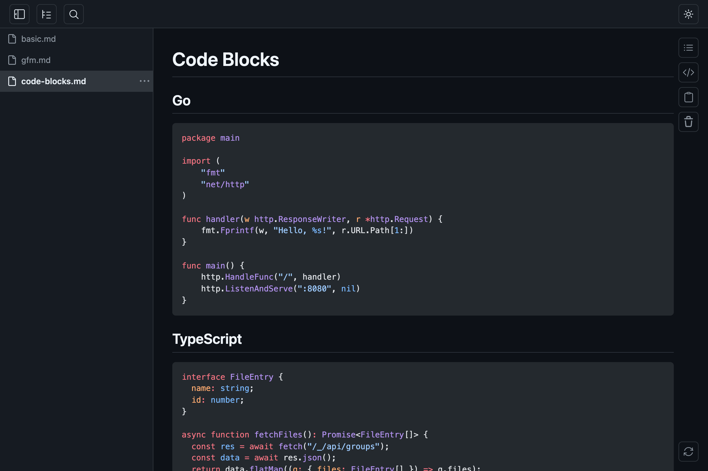
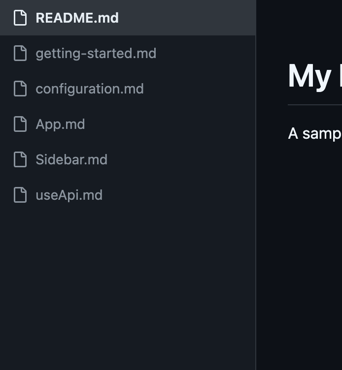
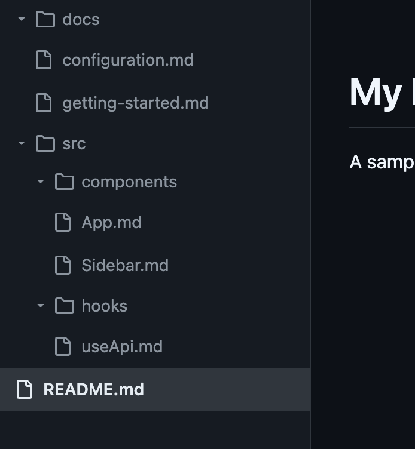

<p align="center">
<br><br><br>

<br><br><br>
</p>

# markview

[](https://github.com/kooksee/markview/actions/workflows/ci.yml)   

`markview` 是一个在浏览器中打开 `.md` 文件并支持实时刷新的 Markdown 浏览工具。

> 如果你在使用 AI 编码助手或需要项目约束说明，请以 `.github/copilot-instructions.md` 为准。

> [!NOTE]
> **项目来源与版权说明**
>
> 本项目基于 [k1LoW/mo](https://github.com/k1LoW/mo) 演进开发，遵循其开源许可（MIT）。
> 为尊重原作者与版权，本仓库保留来源标注与许可说明；详见根目录 `NOTICE` 与 `LICENSE`。

## 功能特性

- 支持 GitHub 风格 Markdown（表格、任务列表、脚注等）
- 代码高亮（[Shiki](https://shiki.style/)）
- [Mermaid](https://mermaid.js.org/) 图表渲染
- LaTeX 数学公式（[KaTeX](https://katex.org/)）
-  深色 /  浅色主题切换
-  文件分组管理
-  文档目录面板
-  平铺 /  树形侧边栏（支持拖拽排序与文件搜索）
- 思维导图与图谱视图：支持文档结构可视化与联动阅读定位
- YAML 前置元数据展示（可折叠元数据区域）
- MDX 支持（渲染 Markdown，去除 `import`/`export`，转义 JSX 标签）
-  宽版 /  窄版阅读宽度切换
-  原始 Markdown 视图
-  内容复制（Markdown / 文本 / HTML）
-  服务重启并保留会话
- 自动会话备份与恢复
- 支持从操作系统文件管理器拖拽添加文件（内容以内存形式加载，拖拽文件不支持实时刷新）
- 对通过命令行打开的文件支持保存后实时刷新

## 安装

**Homebrew：**

```console
$ brew install kooksee/tap/markview
```

**手动安装：**

从 [发布页](https://github.com/kooksee/markview/releases) 下载对应平台二进制文件。

## 使用方式

```console
$ markview README.md                          # 打开单个文件
$ markview README.md CHANGELOG.md docs/*.md   # 打开多个文件
$ markview spec.md --target design            # 打开到指定分组
```

`markview` 会在浏览器中展示 Markdown 内容，并在文件保存后自动刷新页面。

### 单服务、多文件

默认情况下，`markview` 在 `6275` 端口启动单个服务。

当同端口已存在 `markview` 服务时，后续命令不会重复启动进程，而是把新文件追加到已有会话中。

```console
$ markview README.md          # 后台启动 markview
$ markview CHANGELOG.md       # 将文件追加到已运行服务
```

如果你需要完全独立的会话，换一个端口即可：

```console
$ markview draft.md -p 6276
```



### 分组

可通过 `--target`（`-t`）把文件归入命名分组。每个分组对应一个 URL 路径与独立侧边栏。

```console
$ markview spec.md --target design      # 打开到 http://localhost:6275/design
$ markview api.md --target design       # 追加到 design 分组
$ markview notes.md --target notes      # 打开到 http://localhost:6275/notes
```


### 通配模式监听

使用 `--watch`（`-w`）注册通配模式。匹配到的文件会自动打开，匹配目录也会被持续监听以发现新文件。

```console
$ markview --watch '**/*.md'                          # 递归监听并打开所有 .md
$ markview --watch 'docs/**/*.md' --target docs       # 监听 docs 目录并放入 docs 分组
$ markview --watch '*.md' --watch 'docs/**/*.md'      # 同时注册多个模式
```

`--watch` 不能与文件参数同时使用。`**` 表示递归目录匹配。

#### 移除监听模式

使用 `--unwatch` 取消已注册模式。已添加进侧边栏的文件不会被自动移除。

```console
$ markview --unwatch '**/*.md'                              # 取消默认分组中的模式
$ markview --unwatch 'docs/**/*.md' --target docs            # 取消 docs 分组中的模式
$ markview --unwatch '/Users/you/project/**/*.md'            # 按绝对路径取消
```

模式会先解析为绝对路径再匹配，因此你可以使用相对路径，也可以使用 `--status` 输出中的绝对路径。

### 侧边栏视图模式

侧边栏支持平铺和树形两种视图：

|  平铺 |  树形 |
| ------------------------------------------------------- | ------------------------------------------------------- |
|                     |                     |

### 启动与停止

`markview` 默认后台运行，命令会立即返回，不阻塞当前终端。

```console
$ markview README.md
markview: serving at http://localhost:6275 (pid 12345)
$ # 终端可继续使用
```

使用 `--status` 查看服务状态，使用 `--shutdown` 停止服务：

```console
$ markview --status              # 查看所有 markview 服务
http://localhost:6275 (pid 12345, v0.12.0)
  default: 5 file(s)
    watching: /Users/you/project/src/**/*.md, /Users/you/project/*.md
  docs: 2 file(s)
    watching: /Users/you/project/docs/**/*.md

$ markview --shutdown            # 关闭默认端口服务
$ markview --shutdown -p 6276    # 关闭指定端口服务
$ markview --restart             # 重启默认端口服务
```

如果需要前台运行（例如调试时），可使用 `--foreground`：

```console
$ markview --foreground README.md
```

### 服务重启

你可以点击页面右下角的  重启按钮，或执行 `markview --restart`。

重启后会保留当前会话（分组与文件列表），适合在升级二进制后无缝切换到新版本。

### 会话备份与恢复

`markview` 会在文件或模式发生变更时自动保存会话状态（按分组保存文件与监听模式）。

当服务再次启动时，会自动恢复上次会话，并与本次命令行参数合并（恢复项优先，新参数追加，去重处理）。

```console
$ markview README.md CHANGELOG.md       # 启动并打开两个文件
$ markview --shutdown                   # 关闭服务
$ markview                              # 恢复 README.md 与 CHANGELOG.md
$ markview TODO.md                      # 恢复会话并追加 TODO.md
```

使用 `--clear` 可以清理某个端口的会话备份：

```console
$ markview --clear                      # 清理默认端口备份
$ markview --clear -p 6276              # 清理指定端口备份
```

### JSON 输出

使用 `--json` 可以将结果输出为结构化 JSON，便于脚本或自动化工具调用。

```console
$ markview --json README.md
{
  "url": "http://localhost:6275",
  "files": [
    {
      "url": "http://localhost:6275/?file=a1b2c3d4",
      "name": "README.md",
      "path": "/Users/you/project/README.md"
    }
  ]
}
```

`--status` 也支持 `--json`：

```console
$ markview --status --json
[
  {
    "url": "http://localhost:6275",
    "status": "running",
    "pid": 12345,
    "version": "0.15.0",
    "revision": "abc1234",
    "groups": [
      {
        "name": "default",
        "files": 3,
        "patterns": ["**/*.md"]
      }
    ]
  }
]
```

### 参数说明

| 参数           | 简写 | 默认值    | 说明                       |
| -------------- | ---- | --------- | -------------------------- |
| `--target`     | `-t` | `default` | 分组名称                   |
| `--port`       | `-p` | `6275`    | 服务端口                   |
| `--bind`       | `-b` | `0.0.0.0` | 绑定地址（如 `localhost`） |
| `--open`       |      |           | 总是打开浏览器             |
| `--no-open`    |      |           | 不自动打开浏览器           |
| `--status`     |      |           | 查看运行中的 markview 服务 |
| `--watch`      | `-w` |           | 监听通配模式（可重复）     |
| `--unwatch`    |      |           | 移除已监听的模式（可重复） |
| `--shutdown`   |      |           | 关闭运行中的 markview 服务 |
| `--restart`    |      |           | 重启运行中的 markview 服务 |
| `--clear`      |      |           | 清理指定端口的会话备份     |
| `--foreground` |      |           | 前台运行服务               |
| `--json`       |      |           | 以 JSON 输出结构化结果     |

> [!WARNING]
> 当 `--bind` 设置为非回环地址时，markview 会暴露到网络，且默认没有鉴权机制。远程客户端可能读取当前用户可访问文件、浏览通配目录并控制服务启停。该场景仅建议用于可信网络。

## 构建

需要 Go 与 [pnpm](https://pnpm.io/) 环境。

```console
$ make build
```

## 中文文档

为了便于本地阅读和二次开发，仓库提供了以下中文文档：

- [可视化快速上手](docs/quick-start-visual.md)
- [设计文档](docs/design.md)
- [架构文档](docs/architecture.md)
- [Markdown 能力清单](docs/markdown-capabilities.md)
- [全局搜索功能说明](docs/global-search.md)

### 中文速览

- 架构形态：Go 后端 + React 前端，最终以单二进制分发
- 运行机制：命令行单实例复用 + HTTP 接口 + 服务端事件流实时刷新
- 状态策略：服务端状态中心（groups/files/patterns）+ XDG 会话备份恢复
- 工程化：Makefile、CI（lint/test/coverage）、GoReleaser 多平台发布

## 术语说明

| 中文称呼     | 代码中的常见写法 | 说明                              |
| ------------ | ---------------- | --------------------------------- |
| 命令行入口   | `CLI`            | 指命令行程序入口与参数处理逻辑    |
| 接口         | `API`            | 指前后端通过 HTTP 调用的内部接口  |
| 服务端事件流 | `SSE`            | 用于将服务端变更实时推送到前端    |
| 监听模式     | `watch pattern`  | 通过 `--watch` 注册的通配路径规则 |
| 前置元数据   | `Frontmatter`    | Markdown 文件顶部的 YAML 元数据块 |
| 目录面板     | `ToC`            | 文档标题目录导航面板              |
| 原文视图     | `Raw`            | 直接查看 Markdown 原始文本        |

## 参考项目

- [yusukebe/gh-markdown-preview](https://github.com/yusukebe/gh-markdown-preview)：在 GitHub 风格下预览 Markdown 的 GitHub CLI 扩展。

## 许可证

- [MIT License](LICENSE)
  - 包含源码与 logo 在内的项目整体以 MIT 许可发布。
  - logo 也可单独按 [CC BY 4.0](https://creativecommons.org/licenses/by/4.0/) 使用。
  - 在不修改 logo 且用于 markview 技术说明场景时，通常可不强制要求额外版权标注。

### 上游来源致谢

- Upstream: [k1LoW/mo](https://github.com/k1LoW/mo)
- 上游许可：MIT（Copyright © 2026 Ken'ichiro Oyama）
- 归属与说明：见本仓库 `NOTICE`
