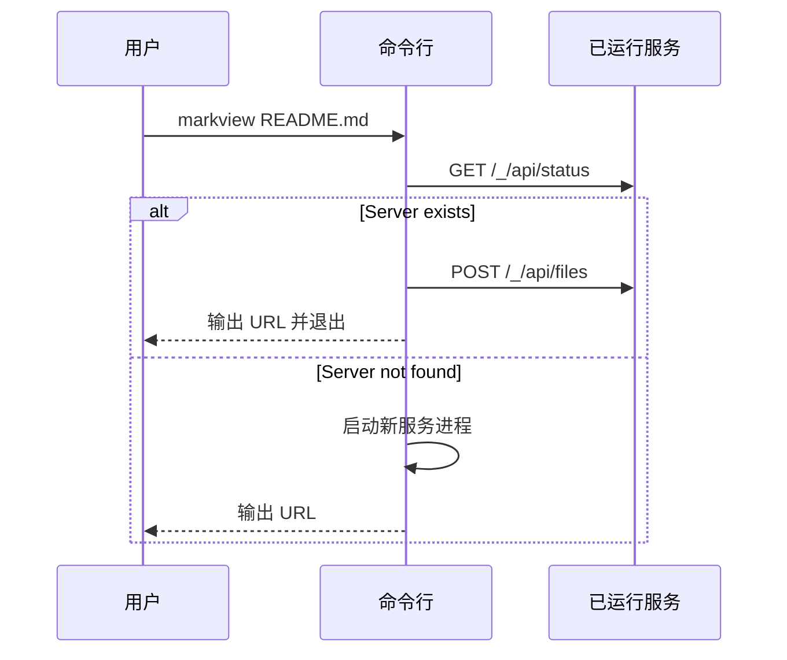
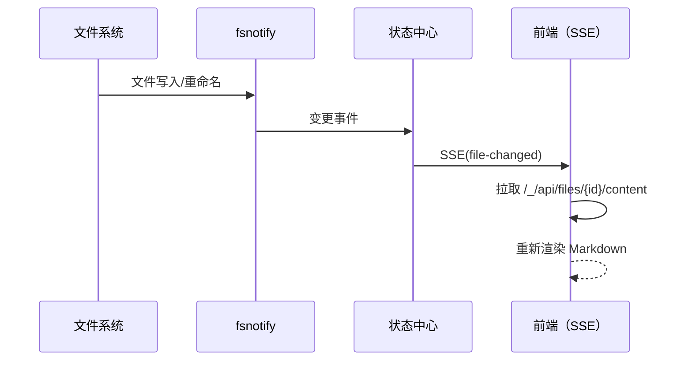

# markview 架构文档

## 1. 架构总览

`markview` 采用 **Go 后端 + React 前端 + 单二进制分发** 的架构：

```mermaid
flowchart LR
    CLI[命令行入口 / cmd/root.go] -->|启动/复用| HTTP[Go HTTP 服务]
    HTTP --> STATE[状态中心\n(groups/files/patterns)]
    HTTP --> WATCH[fsnotify]
    WATCH --> SSE[SSE /_/events]
    SSE --> SPA[React SPA]
    SPA --> API[/_/api/*]
    API --> STATE
    STATE --> BACKUP[会话备份 JSON\nXDG_STATE_HOME]
    SPA --> STATIC[前端静态资源]
    STATIC --> HTTP
```

核心特征：

- **单实例复用**：同端口优先复用已有进程。
- **服务端状态中心**：分组、文件、watch 模式统一由后端维护。
- **前后端松耦合**：通过 HTTP 接口 + SSE 通信。
- **内嵌前端静态资源**：最终交付为单可执行文件。

## 2. 目录与模块职责

| 模块            | 路径                                         | 职责                                       |
| --------------- | -------------------------------------------- | ------------------------------------------ |
| CLI 入口        | `cmd/root.go`                                | 参数解析、单实例探测、前后台启动、状态命令 |
| 服务状态与路由  | `internal/server/server.go`                  | HTTP API、SSE、文件监听、状态管理          |
| 链接/大纲图构建 | `internal/server/graph.go`                   | 从 Markdown 内容提取关系并输出图数据       |
| 分组名规范      | `internal/server/group.go`                   | 分组名归一化与安全校验                     |
| 备份存储        | `internal/backup/backup.go`                  | 会话快照读写（原子写）                     |
| 静态资源嵌入    | `internal/static/static.go`                  | 触发前端构建并 `go:embed` 嵌入             |
| 前端主流程      | `frontend/src/App.tsx`                       | 路由状态、分组/文件选择、SSE 刷新          |
| 前端渲染核心    | `frontend/src/components/MarkdownViewer.tsx` | Markdown 渲染与图表增强                    |
| API 封装        | `frontend/src/hooks/useApi.ts`               | 前端到后端接口调用                         |
| SSE 订阅        | `frontend/src/hooks/useSSE.ts`               | 实时事件与断线重连                         |

## 3. 关键运行时序

## 3.1 启动与复用



## 3.2 文件变更到页面刷新



## 4. 数据与状态模型

## 4.1 服务端状态

- `groups`: 当前分组及文件列表
- `patterns`: 当前 watch 的 glob 模式集合
- `watchedDirs`: 被监听目录的引用计数
- `subscribers`: SSE 订阅者集合

通过 `RWMutex` 保护并发读写。

## 4.2 持久化模型

`RestoreData` 结构包含：

- `Groups`: 分组到文件路径列表
- `Patterns`: 分组到 watch 模式列表
- `UploadedFiles`: 内存上传文件快照

状态在变更后触发去抖保存；启动时读取并合并 CLI 参数。

## 5. API 边界

内部 API 统一使用 `/_/api/*` 前缀，避免与用户分组路由冲突：

- 文件管理：`POST /_/api/files`、`DELETE /_/api/files/{id}`
- 内容读取：`GET /_/api/files/{id}/content`
- 分组与排序：`PUT /_/api/files/{id}/group`、`PUT /_/api/reorder`
- 模式管理：`POST/DELETE /_/api/patterns`
- 运行控制：`POST /_/api/restart`、`POST /_/api/shutdown`
- 状态检查：`GET /_/api/status`、`GET /_/api/version`
- 实时事件：`GET /_/events`

## 6. 构建与发布架构

## 6.1 本地构建

- `go generate ./internal/static/`：构建前端产物到 `internal/static/dist`
- `go build`：打包 Go 服务 + 内嵌静态资源

## 6.2 CI/CD

- CI：前端 lint/format、Go lint、测试覆盖率
- Release：`tagpr` 管理版本，`goreleaser` 产出多平台二进制
- License：Trivy 做许可证扫描

## 7. 安全与边界

1. 默认本地网络使用；非回环地址绑定需显式确认。
2. 内部 API 无认证，面向本机可信环境。
3. 文件原始资源访问路径带目录边界校验，防止目录穿越。

## 8. 可扩展建议

1. 鉴权与访问控制：为远程协作模式增加 token/ACL。
2. 文档规模扩展：搜索与解析任务可进一步 Worker 化。
3. 模块拆分：继续降低 `MarkdownViewer` 复杂度，提升前端可维护性。
