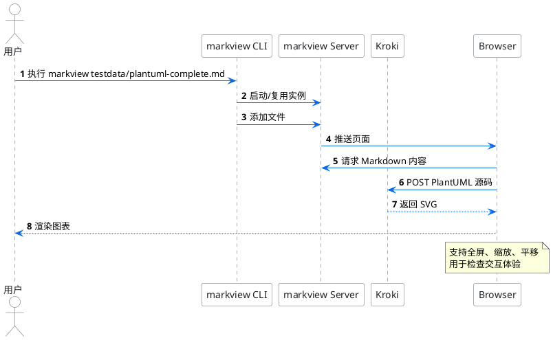
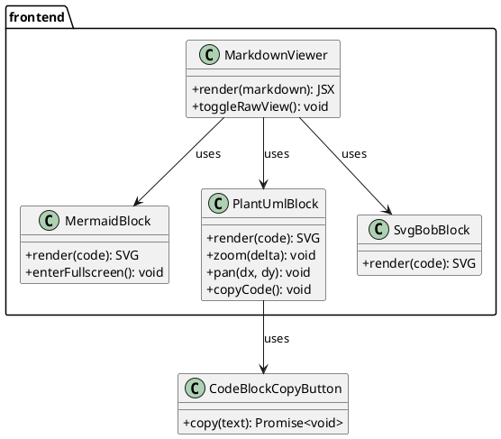
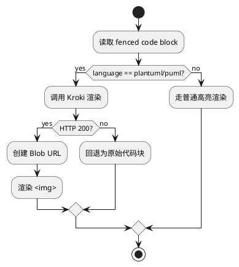
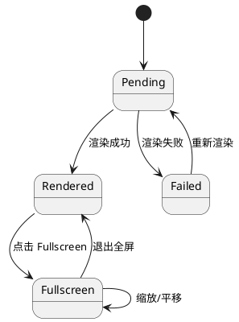
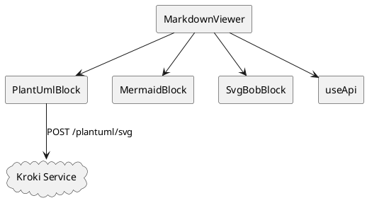
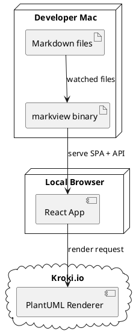
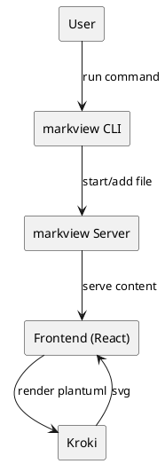
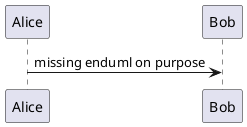

# PlantUML Complete Showcase

这个文档用于完整检查 PlantUML 在 `markview` 里的渲染效果。  
建议重点观察：中文文本、主题切换、全屏/缩放/平移、复杂连线可读性。

---

## 1) Sequence Diagram（时序图）

---

## 2) Class Diagram（类图）

---

## 3) Activity Diagram（活动图）

---

## 4) State Diagram（状态图）

---

## 5) Component Diagram（组件图）

---

## 6) Deployment Diagram（部署图）

---

## 7) C4-Style（通过普通 PlantUML 语法模拟）

---

## 8) 故障回退检查（故意写错）

> 这个块故意语法错误，用于验证“渲染失败时回退到代码显示”。

---

## 验收建议

- 切换亮/暗主题，检查对比度是否可读。
- 点击全屏后测试：滚轮缩放、鼠标拖拽平移、重置。
- 检查失败块是否稳定回退而不影响其他图。
- 检查中文文本与箭头标签是否清晰。
