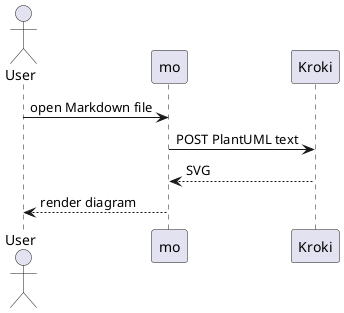
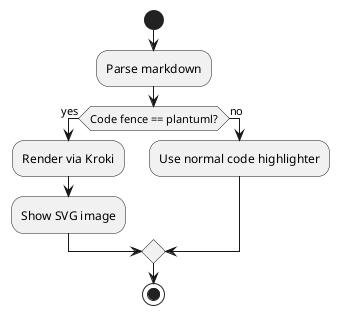

# PlantUML demo

```plantuml
@startuml
actor User
participant "mo" as MO
participant Kroki

User -> MO: open Markdown file
MO -> Kroki: POST PlantUML text
Kroki --> MO: SVG
MO --> User: render diagram
@enduml
```

```puml
@startuml
skinparam monochrome true
start
:Parse markdown;
if (Code fence == plantuml?) then (yes)
  :Render via Kroki;
  :Show SVG image;
else (no)
  :Use normal code highlighter;
endif
stop
@enduml
```
